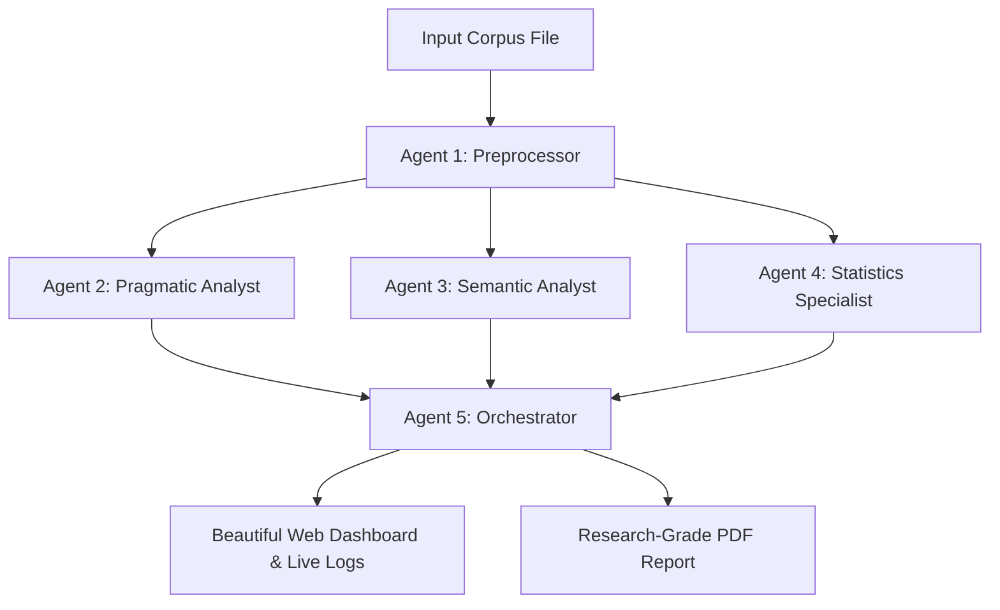

# PMDD: Pragmatic Meaning Drift Detector  
## Multi-Agent System for Linguistic Analysis

**PMDD** is a cutting-edge computational linguistics research platform designed to detect subtle meaning shifts (pragmatic drift) across large text corpora. Using a team of 5 specialized cooperative AI agents and the high-performance **NVIDIA-hosted Gemma 3** (`google/gemma-3n-e4b-it`) model, PMDD quantifies semantic divergence while providing research-grade, evidence-backed visual dashboards and downloadable PDF reports.

---

## 📋 Project Overview

PMDD solves the challenge of tracking meaning evolution and lexical drift in scientific and historical language over time. By uploading a text corpus, the system automatically analyzes:

*   **Speech Act Shifts**: Dominant illocutionary act changes (Searle) across different corpus segments.
*   **Gricean Maxim Violations**: Increases/decreases in Quantity, Quality, Relation, and Manner violations.
*   **Politeness & Register Drift**: Tenor, Field, and Mode shifts (Halliday) alongside register borrowing events.
*   **Semantic Field Migrations**: Lexical drift of core keywords moving from their traditional semantic fields (Lyons) to new ones.
*   **Corpus Statistics**: Statistical validation including type-token ratios (TTR), Bigrams, Hapax Legomena, and Pointwise Mutual Information (PMI) collocational profiles.

### Key Features

*   **Multi-Agent Pipeline**: 5 autonomous agents work sequentially, communicating and passing analytical context through an episodic SQLite memory database.
*   **Snappy API Retries**: Advanced error retry mechanisms with randomized exponential backoff (jitter) to slip through rate limits seamlessly.
*   **Unified Web Dashboard**: Responsive, rich UI featuring dynamic Server-Sent Events (SSE) providing live progress logs.
*   **Research-Grade PDF Reports**: Generates formal, double-column PDF reports featuring a calibrated 40% quantitative and 60% qualitative evidence balance.

---

## 🚀 Getting Started

### Prerequisites

*   **Python 3.10+**
*   **NVIDIA API Key**: Obtain a free API key from the NVIDIA API Catalog.
*   **Environment Variables**:
    Create a `.env` file inside the `pmdd` directory:
    ```env
    NVIDIA_API_KEY=your_nvidia_api_key_here
    ```

### Installation

1.  **Clone the repository**
    ```bash
    git clone https://github.com/rameenzel-creator/agentic-AI-PMDD_Project.git
    cd agentic-AI-PMDD_Project
    ```

2.  **Create and activate a virtual environment**
    ```bash
    python -m venv .venv
    .venv\Scripts\activate  # On macOS/Linux use: source .venv/bin/activate
    ```

3.  **Install dependencies**
    ```bash
    pip install -r requirements.txt
    ```

---

## 🧠 Agent System Architecture

The PMDD framework consists of five highly specialized linguistic agents:

| Agent | Theoretical Framework | Role & Key Responsibilities |
| :--- | :--- | :--- |
| **Agent 1: Preprocessor** | Sinclair's Corpus Linguistics | Text normalization, sentence segmentation, temporal/genre section splitting, and token lemmatization. |
| **Agent 2: Pragmatic Analyst** | Austin/Searle Speech Act, Gricean Maxims | Connotation analysis, Gricean maxim violation tracking, politeness rating, and Chain-of-Verification (CoV) self-correction on low-confidence assessments. |
| **Agent 3: Semantic Analyst** | Lyons' Semantic Field Theory | Registers and Tenor, Field, Mode shifts. Identifies keyword field migration, register borrowing events, and builds lexical drift maps. |
| **Agent 4: Statistician** | Sinclair & Scott Keyness | Pure mathematical computation. Calculates per-section TTRs, hapax legomena ratios, bigram tables, and MI collocational score matrices. |
| **Agent 5: Orchestrator** | Fairclough's Critical Discourse Analysis | Evaluates cross-agent outcomes, checks analysis coverage, runs final CDA synthesis, computes the overall Meaning Drift Score (MDS), and prepares the report metadata. |

### Collaboration Workflow



---

## 🏃‍♂️ Running the Web Server

Start the application with a single command:

```bash
# Move to the pmdd directory
cd pmdd

# Start the FastAPI uvicorn development server
python run.py
```

Once the server initializes, navigate to:
👉 **[http://127.0.0.1:8000](http://127.0.0.1:8000)**

### 💡 Demo Run Instructions
For a rapid demonstration of the entire pipeline, select the pre-made **`demo_corpus.txt`** in the web dashboard. This corpus is specially designed with a curated linguistic drift for the keyword **'protocol'** (evolving from traditional manual logs to digital cloud pipelines) and runs in **under 60 seconds**!

---

## 📊 PDF Report Structure

The generated reports (located in `pmdd/reports/`) are constructed with academic rigor:

1.  **Title Page & MDS:** Displays the overall Meaning Drift Score (0-100) and its general classification.
2.  **Executive Summary:** Deep qualitative and quantitative overview of the semantic shifts.
3.  **Corpus Metadata (Agent 1):** Detailed segments, words, and basic density counts.
4.  **Quantitative substrate (Agent 4 - 40%):** Tabular section-level TTRs, collocates, and MI score matrices.
5.  **Qualitative Evidence (Agents 2 & 3 - 60%):** Searle speech-act breakdowns, Gricean violations, and direct corpus quote boxes.
6.  **Agentic Reflection Log:** Complete transparency showing where the pragmatic agent invoked its CoV self-correction rules.
7.  **Conclusions & Future Directions:** Grounded scholarly recommendations for future research.

---

## 📁 Project Structure

```
pmdd/
├── agents/                  # The 5 specialized linguistic agents
│   ├── agent1_preprocessor.py
│   ├── agent2_pragmatic.py
│   ├── agent3_semantic.py
│   ├── agent4_statistics.py
│   └── agent5_orchestrator.py
├── utils/                   # Shared utility modules
│   ├── llm_handler.py       # NVIDIA Gemma API connector with randomized backoff
│   ├── memory.py            # Episodic SQLite memory manager & database
│   └── pdf_generator.py     # PDF Generator wrapped with character-sanitization
├── frontend/                # Beautiful SPA Web Dashboard
│   ├── index.html
│   ├── style.css            # Dark mode, premium styling
│   └── app.js               # Reactive SSE client
├── reports/                 # Holds generated PDF reports (ignored by Git)
├── uploads/                 # Holds raw uploaded text corpora (ignored by Git)
├── demo_corpus.txt          # Pre-packaged fast-running demo corpus
├── requirements.txt         # Package requirements (FastAPI, spaCy, FPDF, requests)
└── run.py                   # Main startup launcher script
```

---

## 🔌 API Key Configuration

Make sure your API Catalog key is defined in the `.env` file at the root of the project:
```env
NVIDIA_API_KEY=nvapi-your-key-here
```

---

## 🎯 Future Roadmap

*   [x] Highly responsive web interface with live progress monitoring
*   [x] Smart exponential backoff with random jitter to defeat API 429 errors
*   [x] Unicode font character sanitization to protect PDF exports
*   [ ] Multi-model integration (adding Claude 3.5 & GPT-4o-mini alongside Gemma 3)
*   [ ] Interactive semantic field network graph visualization in the dashboard
*   [ ] Persistent Postgres/Supabase database engine integration for mega-scale corpora

---

## 📝 License

This project is licensed under the MIT License - see the [LICENSE](LICENSE) file for details.

---

## 📞 Contact & Support

For queries, collaborations, or research issues, please reach out to:

*   **Email**: rameenafzal295@gmail.com
*   **GitHub**: [rameenzel-creator](https://github.com/rameenzel-creator)

---

**Last Updated**: May 2026  
**Version**: 2.2.0  
**Status**: Production-Ready / Stable
